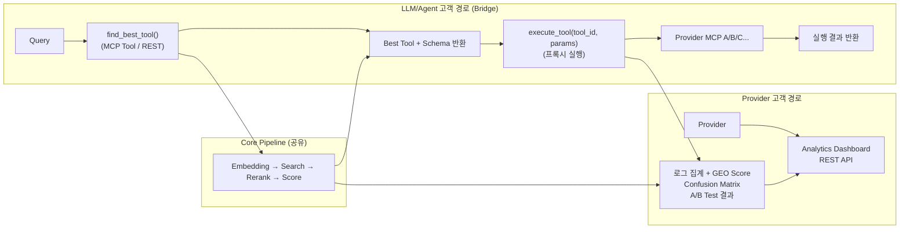
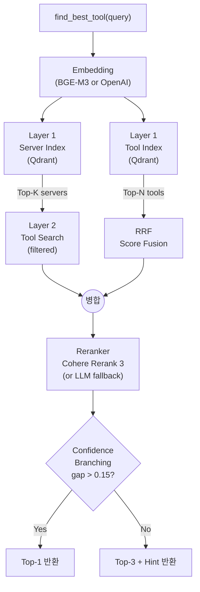
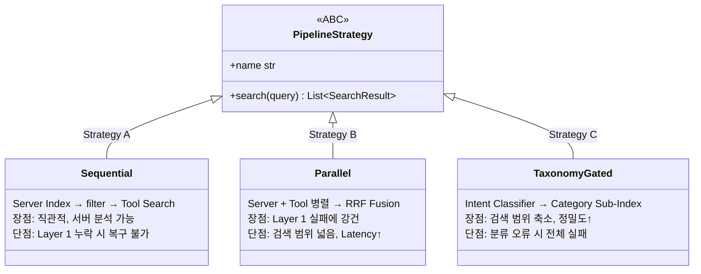
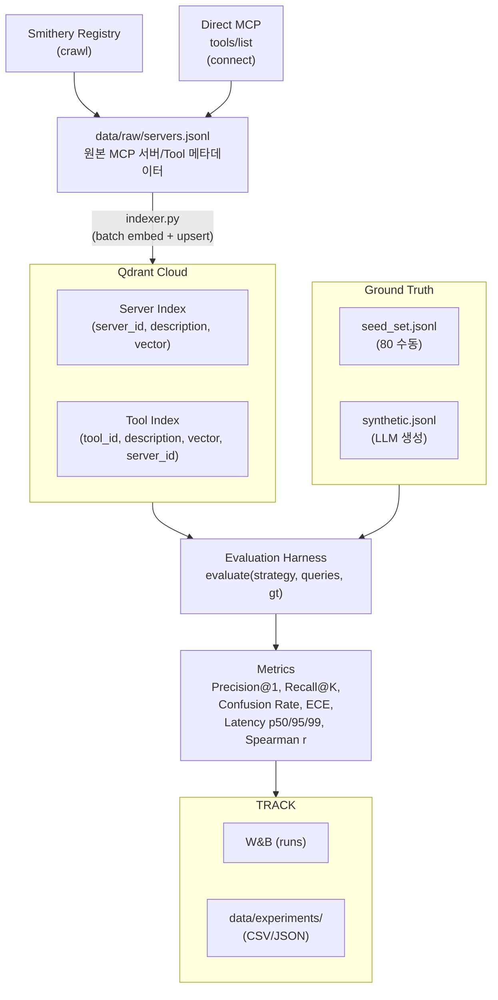
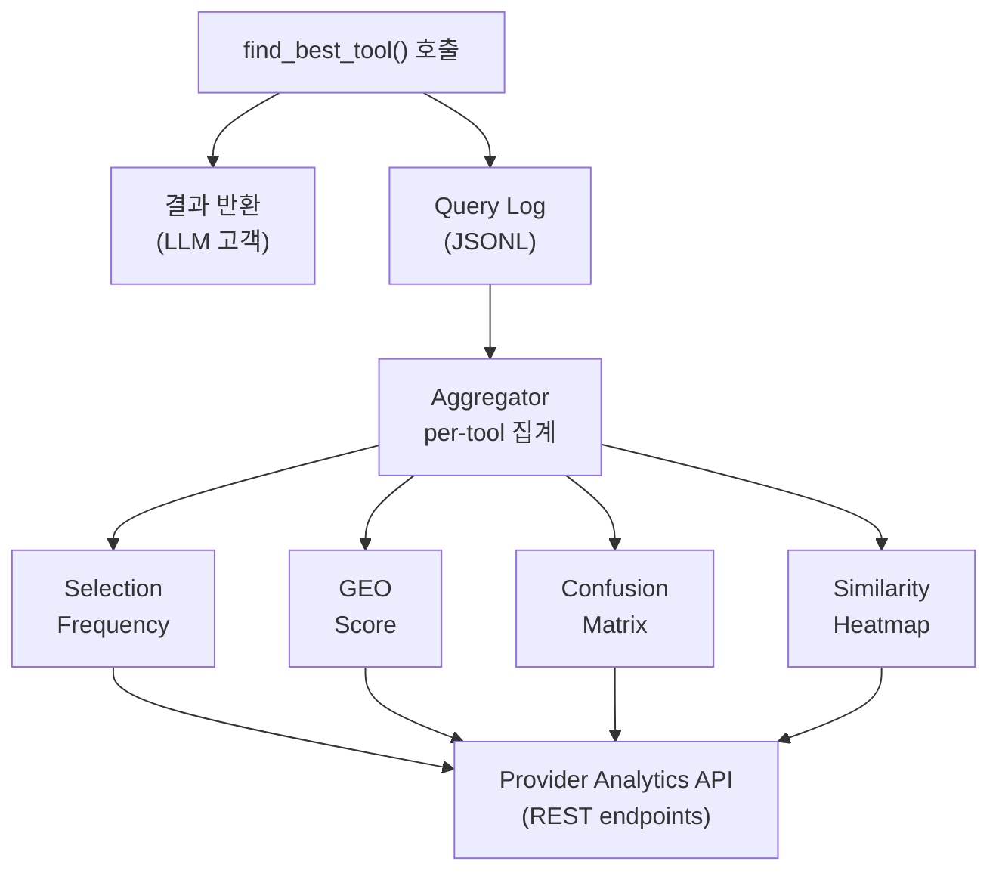
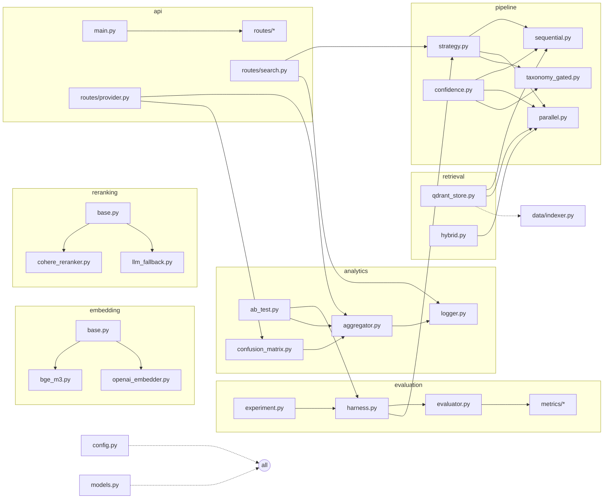
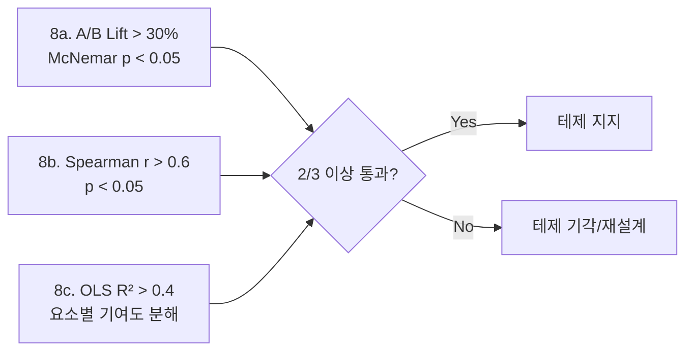

# Architecture — Mermaid Diagrams

> 최종 업데이트: 2026-03-22
> 결정 사항/기술 스택: `./architecture.md`

---

## 1. 양면 플랫폼 구조

---

## 2. Core Pipeline — 2-Stage Retrieval

---

## 3. Strategy Pattern — 3가지 검색 전략

---

## 4. 데이터 흐름

---

## 5. Provider Analytics 파이프라인

---

## 6. 모듈 의존관계

---

## 7. Evidence Triangulation (핵심 테제 검증)

- **테제**: "Description 품질이 높을수록 Tool 선택률이 높아진다"

